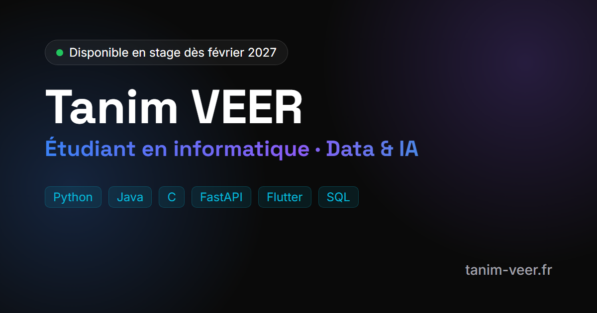

# 🌐 Portfolio — Tanim VEER

**[tanim-veer.fr](https://tanim-veer.fr)** · Étudiant en BUT3 Informatique (parcours Data & IA) à l'Université Paris Cité, à la recherche d'un stage de 3 mois ou plus à partir de février 2027.

## Contenu

- **À propos** et **parcours** : formation, freelance, hackathons et engagements
- **Compétences** par domaine : langages, données, back-end, web et mobile, système et réseau, qualité
- **Projets** filtrables par domaine, avec les liens vers le code et les démos en ligne
- **Contact** : formulaire, email, LinkedIn, GitHub

## Technique

- HTML, CSS et JavaScript, sans framework ni étape de build
- Version anglaise complète : le texte français est écrit dans le HTML, `js/script.js` ne contient que les traductions anglaises
- Thème clair ou sombre (suit par défaut le réglage du système), menu adapté au mobile
- Formulaire de contact géré par Netlify Forms, envoyé sans recharger la page
- Accessibilité : lien d'évitement, textes alternatifs, navigation au clavier, respect de `prefers-reduced-motion`
- Référencement : balises Open Graph avec image d'aperçu, données structurées `Person`, sitemap et `robots.txt`
- Hébergé sur Netlify, déployé automatiquement à chaque push sur `main`

## Lancer en local

Aucune installation : servir le dossier, par exemple avec `python -m http.server`, puis ouvrir `http://localhost:8000`.
Le formulaire de contact ne fonctionne qu'une fois déployé sur Netlify.
